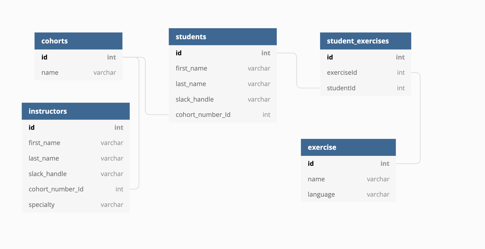

# Student Exercise

Chapters from class that encompass the following:

* Using *Table Plus* for creating and manipulating database with SQLite
* Persistent Data with RDBMS and SQL
* Using SQL in Python
* Handling joined database results
* Experimenting with different queries and results using Python to talk to database
* Architecting code as Model as part of MVC design

## ERD

